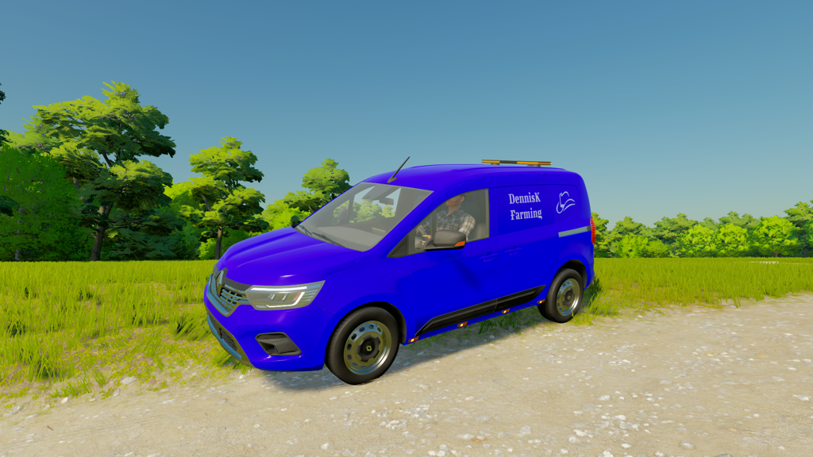
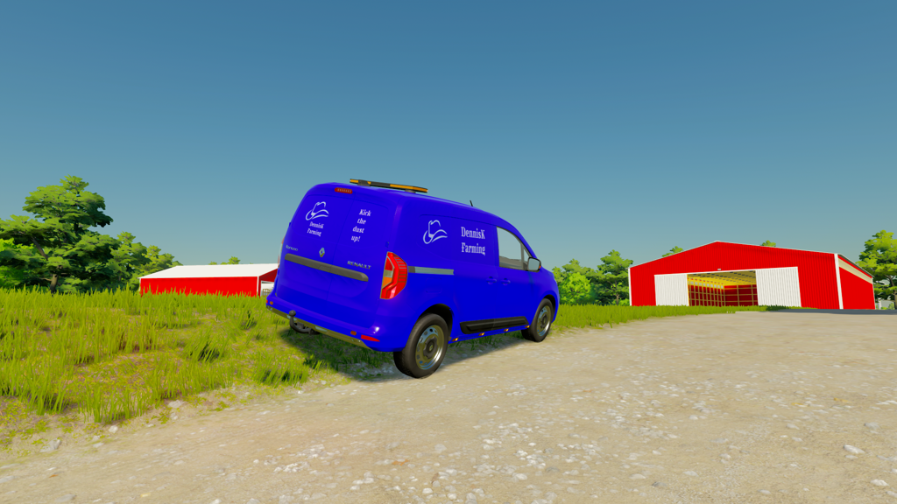
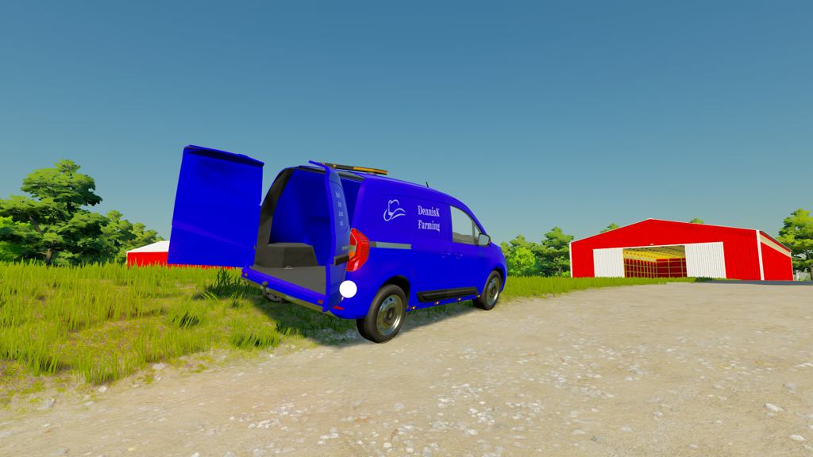
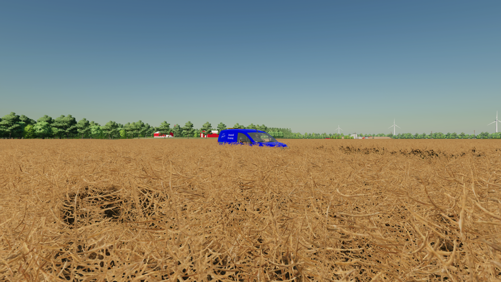
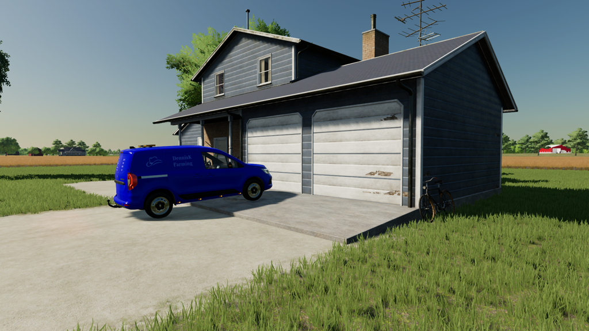
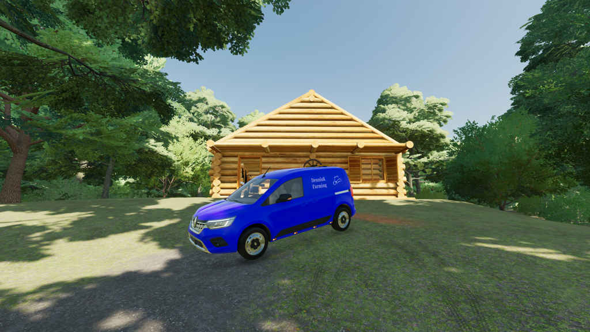
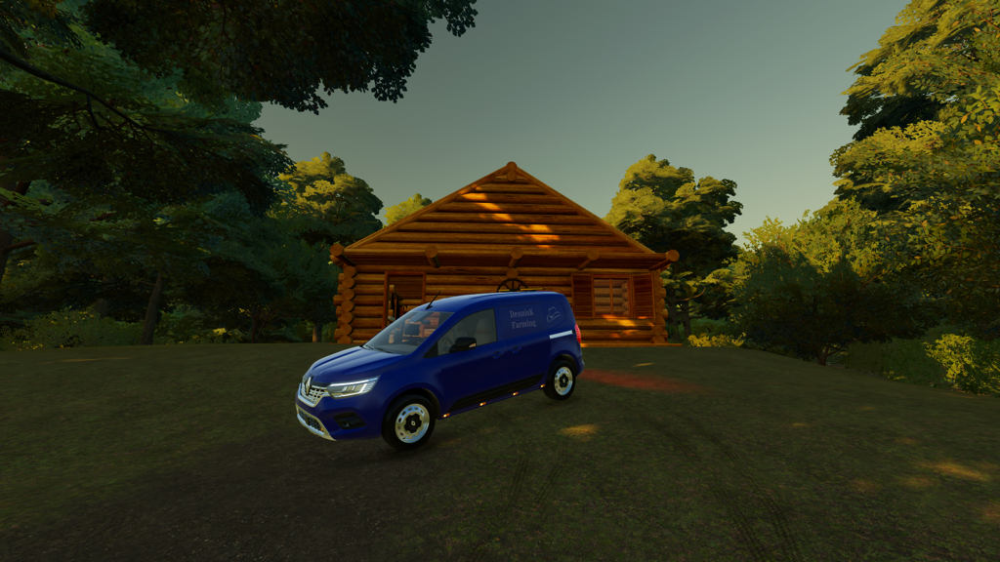
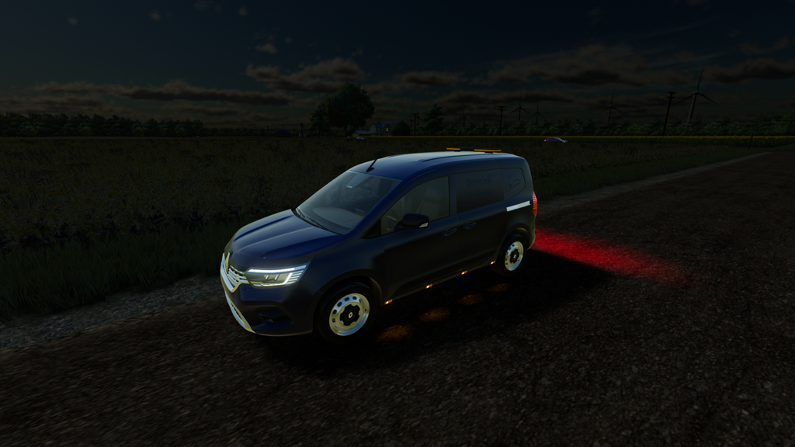

# FS22_DK_edit_Renault_Kangoo_2022

## *A nice way to travel across the map or do a quick delivery*


This car is a quick way to cross the map. With the autoload option it is even possible to do a quick delivery of 1 pallet at a time.




Front view.



Back view.



Back view with open doors.


```
Original author: LesiTheDogg

Contributed by: DennisK

If you distribute this mod, always include this info.

AND DO NOT UPLOAD IT TO MONATERY UPLOAD SERVICES.
THIS MOD IS AVAILABLE TO ANYONE FOR FREE AND YOU CAN USE
IT AND EDIT IT ANYWAY YOU WANT FOR PERSONAL USE.
```


## New upload 2024-02-25 (release 2.0.0)

This is a new upload with minor issues but it is usable.


## Note

A known issue for this mod is that it doesn't have a complete interior. It is missing the dashboard.
I am looking for a place where I can find a decent interior.dashboard I can use in this mod.

Before downloading and using this mod always check the issues page. https://github.com/DennisKgaming/FS22_DK_edit_Renault_Kangoo_2022/issues

Sometimes issue are found and need to be solved first. Not all issues will give problems when using this mod.

## Multiplayer
Multiplayer is tested and supported.


## Guide / documentation

This mod has IC control on it to open doors.

Check the release page for the most recent version of this mod: https://github.com/DennisKgaming/FS22_DK_edit_Renault_Kangoo_2022/releases

Because GitHub has a certain way of packing a release please do the following:
- Unpack zip file
- Take out the main folder
- When in use for multiplayer: Zip the folder you took out of the zip filefolder
- Put (zip) folder in your mod directory


## Screenshots












## Additional information

Since this is a redesigned mod there is no support for console.

If you discover any issues please submit them to the issues page.